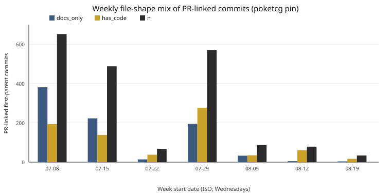

# Bonkers / SEED

Bonkers is a measurement protocol called SEED; the repository was renamed from `thefleet` to `seed-protocol` on 2026-09-02 and the old name redirects, and fleet orchestration is deferred.

**Repository:** [thisisntjon/seed-protocol](https://github.com/thisisntjon/seed-protocol).  
**Object:** a portable measurement protocol for agentic software work, plus one pinned case study.  
**Not:** an agent runtime, a fleet orchestrator, or a claim of autonomy.

Agents cold-start at [`START-HERE.md`](START-HERE.md) and trust nothing until `python scripts/onboard_check.py` is green. Humans landing here start at [`JUDGES.md`](JUDGES.md) if the question is how to score this tree. This file is the research abstract.

## Abstract

Implementation throughput is a poor proxy for verified progress in agent-driven software work. Bonkers records that finding as a small, incident-bounded protocol (**SEED**): claims have falsifiers, guards are sabotage-tested before they are trusted, state lives in git artifacts, humans gate only irreversibles, and spend is scored against closed loops.

The protocol is an *epistemic control plane*. It does not schedule agents. A later factory extract packages portable ideas so a second project does not re-derive them. Whether using SEED improves recovery time, false-progress rate, or human intervention versus a bare project is **hypothesis C-004** and is not claimed.

## Research question

Does an incident-earned, machine-checked control plane reduce invalid completion claims, recovery cost, or unnecessary human intervention relative to a bare repository, without a material drop in correct task completion?

Registered as C-004. Status: **HYPOTHESIS**. The matched ablation is designed and paused (`workflow/experiments/2026-08-08-p3-bare-vs-seed-ablation.md`). A null result is a valid outcome.

## Limitations

- C-004 is untested. Supported rows are about the instrument, not causal benefit.
- The PR case study is n = 1 repository, n = 1 principal, author-run. It does not support a treatment-effect claim. The public dataset is [`workflow/research/2026-08-24-pr-case-study/artifacts/`](workflow/research/2026-08-24-pr-case-study/artifacts/). The source mill (`poketcg`) is a private repository and is not this repository; the public dataset is `artifacts/` here.
- The playbook line “encoded rules never failed again” is **unverified** (`workflow/canon/DECISIONS.md`). Recurrence was not tracked in the source ledger.
- Factory bootstrap (`workflow/blueprint/bin/bootstrap.py`) is not yet a CI fixture. Continuity (`switch.py`) is not built.
- Flipping this remote to a general audience is a human gate (`GATES.md` publication). A clone URL is not a visibility flip.

## Claim status

| ID | Claim | Status |
|---|---|---|
| C-001 | Verified decision/measurement loops are distinguishable from infrastructure activity | SUPPORTED |
| C-002 | The checker detects every defect class in its sabotage suite | SUPPORTED |
| C-003 | The portable core transplants into a second project without domain import or overwrite | SUPPORTED |
| C-004 | Using SEED improves false progress, recovery, or human load versus bare | HYPOTHESIS |
| C-005 | A negative result can be published without being rewritten as success | SUPPORTED |

Falsifiers and bound evidence: [`CLAIMS.md`](CLAIMS.md). Do not upgrade a row by repetition.

## Evidence in this tree

**Case study (author-run, not independently reproduced).**  
[Throughput is not progress](workflow/research/2026-08-24-pr-case-study/PAPER.md) — a census of 1,979 PR-linked commits on `poketcg` (a private repository) at pin `9522a8a`. Pre-registration: [`workflow/experiments/2026-08-24-pr-case-study.md`](workflow/experiments/2026-08-24-pr-case-study.md). Public dataset: [`artifacts/`](workflow/research/2026-08-24-pr-case-study/artifacts/).

Observed on that pin (see `artifacts/summary.json`): 43.2% of PR-linked commits were docs-only; independent human GitHub review in a 40-PR sample was 0/40; a stratified 80-PR inspection found 2 PRs that changed the playing agent. The paper’s estimand is composition and identity, not merge rate.



Source: `workflow/research/2026-08-24-pr-case-study/artifacts/summary.json` field `weekly`. Object: `poketcg` (private repository) @ pin `9522a8a37078d00f46b99a586b825b789b01387d`. Labels: `docs_only` = every changed path is `.md`/`.txt`; `has_code` = at least one `.py`/`.go`/`.js`/`.ts`/`.rs`/`.java`/`.c`/`.cpp`/`.h`; `n` = PR-linked first-parent commits that week (`CODEBOOK.md`). Campaign `docs_only_rate` = 0.432 (855/1979). Author-run, not independently reproduced. The clone that produced the census is not this repository.

**Instrument calibration.** Cold-start comprehension and deceptive-green scoring are registered under `pocs/`. Transplant of the invariant core is receipt-bound (C-003).

**What the instrument contains (not proof it helps).** Factory bins `orient.py`, `bootstrap.py`, and `selftest.py` are runnable in this clone. Doctrine and harvest ledgers stay in-tree and are not the landing page.

## Reproduce

```text
python scripts/onboard_check.py
python scripts/schema_check.py
python scripts/sabotage_test.py
python scripts/poc_check.py
python workflow/blueprint/bin/selftest.py
python workflow/harvest/pack/assemble.py --check
python workflow/blueprint/bin/orient.py
```

CI runs the same commands (`.github/workflows/verify.yml`). A green onboard check means the docs match this tree. It does not mean the research question is answered.

To rerun the case-study instrument against the pinned poketcg SHA, pass an explicit clone path of the private source repository to `workflow/research/2026-08-24-pr-case-study/measure_pr_census.py`. That clone is not this repository. A judge who only clones thefleet can read `artifacts/`; they cannot regenerate the census.

## How to read the tree

| Path | Role |
|---|---|
| `JUDGES.md` | Score the instrument, not C-004 |
| `CLAIMS.md` | Public claims, status, falsifier, bound evidence |
| `LAWS.md` | Incident-earned rules and enforcement grade |
| `START-HERE.md` | Machine door |
| `workflow/experiments/` | Pre-registrations (PASS / KILL / NULL / INVALID-INSTRUMENT) |
| `workflow/research/2026-08-24-pr-case-study/` | Methods, paper, public `artifacts/` |
| `workflow/receipts/` | Banked work; “done” without evidence is invalid |
| `workflow/canon/RETRACTIONS.md` | Numbers that were published and are now false |

## Related work

Watanabe et al. (arXiv:2509.14745) study merge rates of Claude Code pull requests. MSR 2026 mining-challenge papers taxonomize agent-PR communication and human intervention. Those datasets answer acceptance. The case study here asks a different question: what a single-operator factory’s merges *are made of* when GitHub is the coordination substrate.

## Cite

Use [`CITATION.cff`](CITATION.cff). Preferred citation is the case-study report, with the author-run caveat attached.

## License

MIT. See [`LICENSE`](LICENSE).

## Contributing

See [`CONTRIBUTING.md`](CONTRIBUTING.md). Research norms; author XOR verifier. Default mode is one strong agent. Fleet work is opt-in for independent, worktree-isolatable tickets only.
